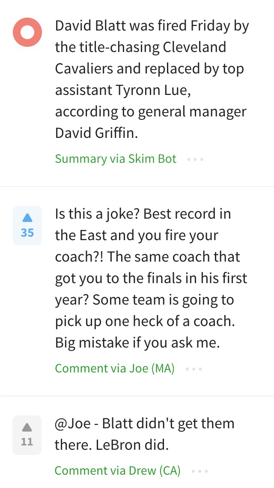

<body> 
	

	

		

		
30

	

    	
    	
    	

    

<i class="fa fa-home"></i>

<i class="fa fa-globe"></i>

    

    

<i class="fa fa-trophy"></i>

<i class="fa fa-laptop"></i>

    

    

<i class="fa fa-money"></i>

<i class="fa fa-hashtag"></i>

    
    
    

    	
    

		
    

    	

    
    	

</body>